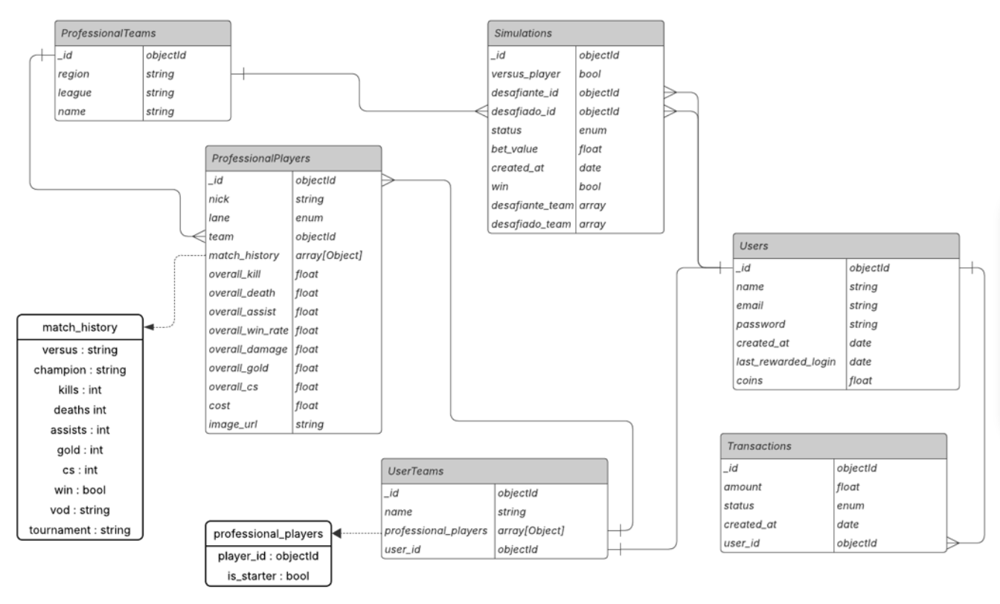

# NexusFC

**Esports Fantasy League** - A platform where users build teams with real professional players and simulate matches using Artificial Intelligence.

---

## About the Project

NexusFC is a Fantasy League system focused on esports (League of Legends), where users can:

- **Build their own team** with professional players from real championships
- **Buy and sell players** in an internal market using virtual coins
- **Simulate matches** against other players (PvP) or against system-controlled teams (PvE)
- **Bet coins** on simulations and win/lose based on the outcome
- **Receive real-time notifications** about match results and challenges

### Artificial Intelligence

The project's highlight is the match simulation using **Google Gemini AI**. 

The AI receives real statistics from professional players (K/D/A, damage, gold, CS, win rate, etc.) and determines which team would win the match, providing results that reflect the athletes' actual performance.

---

## Backend Architecture

### Tech Stack

| Technology | Version
|------------|---------|
| **Java** | 21 | Main language |
| **Spring Boot** | 3.4.4 | Main framework |
| **Spring Security** | - | Authentication and authorization |
| **Spring Data MongoDB** | - | Data persistence |
| **MongoDB** | 8.0.6 | NoSQL database |
| **JWT (Auth0)** | 4.5.0 | Authentication tokens |
| **WebSocket** | - | Real-time notifications |
| **SpringDoc OpenAPI** | 2.8.5 | API documentation |
| **Gemini AI** | 2.0 Flash | Match simulation |
| **Docker Compose** | - | MongoDB orchestration |

---

## Main Features

### 1. Authentication System
- User registration and login
- Stateless authentication with JWT

### 2. Player Market
- Purchase professional players using virtual coins
- Sell players (returns the cost to user)
- Balance and ownership validations
- Atomic transactions

### 3. Match Simulation
- **PvP**: Challenges between two players, with accept/reject system
- **PvE**: Matches against system-controlled teams
- Betting system with virtual coins
- Outcome determined by Gemini AI based on real statistics
- Asynchronous simulation processing

### 4. Team Management
- User team creation
- Adding players to the roster
- Setting starters (5 players - TOP, JG, MID, ADC, SUP)
- Complete formation validation for simulations

### 5. Real-Time Notifications
- WebSocket for bidirectional communication
- Challenge received notifications
- Simulation results

---

## Database Schema



---

## AI Simulation Flow

```
1. User creates simulation (PvP or PvE)
   ↓
2. [PvP] Challenged accepts/rejects → [PvE] Starts directly
   ↓
3. System collects player statistics from both teams
   ↓
4. Prompt is built with formatted statistics
   ↓
5. Gemini AI analyzes and returns the winner (1 or 2)
   ↓
6. System processes result:
   - Updates coins (winner gets 2x, loser loses bet)
   - Marks simulation as COMPLETED
   ↓
7. WebSocket notifications are sent to both players
```

### Statistics Used by AI
- **Nick** and **Lane** of the player
- **K/D/A** (Kills, Deaths, Assists)
- **Overall Damage**
- **Overall Gold**
- **Overall CS** (Creep Score)
- **Overall Win Rate**
- **Player Cost** in the market

---

## Main Endpoints

| Method | Endpoint | Description |
|--------|----------|-------------|
| `POST` | `/auth/register` | User registration |
| `POST` | `/auth/login` | Login (returns JWT) |
| `GET` | `/professional/players` | List professional players |
| `POST` | `/market/buy` | Buy player (body: userId, playerId) |
| `POST` | `/market/sell` | Sell player (body: userId, playerId) |
| `GET` | `/users/{id}` | Get user data |
| `GET` | `/users/{id}/team` | Get user team |
| `PATCH` | `/users/{id}/team` | Update team name |
| `PATCH` | `/users/{id}/team/starter` | Set starter player |
| `POST` | `/simulations` | Create new simulation |
| `GET` | `/simulations/{id}` | Get simulation by ID |
| `GET` | `/simulations/{id}/accept` | Accept PvP challenge |
| `GET` | `/simulations/{id}/reject` | Reject PvP challenge |
| `GET` | `/simulations/{id}/start` | Start PvE simulation |
| `GET` | `/simulations/history/{userId}` | Simulation history |

---
